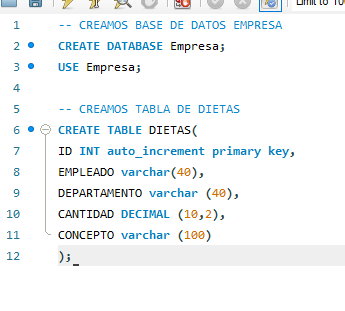

# Actividad de Evaluación – Unidad 9: Dietas relacionales

Esta actividad pertenece a la Unidad 9 del módulo de Programación de 1º DAM.  
El objetivo general ha sido trabajar con una base de datos relacional desde Java, utilizando JDBC y MySQL Workbench para insertar, consultar y modificar datos reales de dietas de empresa.

---

## Lo que he hecho en esta actividad

### 🔹 Conexión a la base de datos
He creado una base de datos llamada `Empresa` desde MySQL Workbench, y dentro de ella una tabla llamada `Dietas` con los campos:
- `id` (clave primaria, autoincremental)
- `empleado`
- `departamento`
- `cantidad` (en euros)
- `concepto`

He creado una clase Java llamada `ConexionBD` que gestiona la conexión con la base de datos mediante JDBC, usando `DriverManager`.

---

### 🔹 Inserción de registros
He creado una clase `InsertarDietas`, que inserta 10 dietas reales en la tabla, distribuidas entre los departamentos de **Informática**, **Ventas** y **Recursos Humanos**.  
He utilizado `PreparedStatement` para insertar los registros correctamente y evitar errores.

---

### 🔹 Consulta filtrada
En otra clase llamada `ConsultarDietas`, he realizado una consulta que muestra por pantalla únicamente las dietas del departamento **Informática** que tengan un importe superior a **30 €**.  
Para ello he usado una sentencia `SELECT` con filtro `WHERE` y he mostrado los resultados usando un `ResultSet`.

---

### 🔹 Actualización de datos
Para completar la actividad, he creado una clase `ActualizarDietasVentas` que actualiza las dietas del departamento **Ventas**, incrementando todas las cantidades en un **10 %**.  
La sentencia SQL utilizada ha sido un `UPDATE` con multiplicación (`cantidad = cantidad * 1.10`).

---

## Herramientas que he utilizado

- **MySQL Workbench:** para crear y comprobar la base de datos y la tabla.
- **Java 24** con IntelliJ IDEA como entorno de desarrollo.
- **JDBC con el conector oficial de MySQL** (`mysql-connector-j`) para las operaciones de conexión, inserción, consulta y actualización.

---

Todo el trabajo se ha realizado desde cero, paso a paso, aplicando lo aprendido en la unidad.  
He comprobado en cada paso que los datos se almacenaban, consultaban y actualizaban correctamente tanto desde Java como desde MySQL Workbench.
